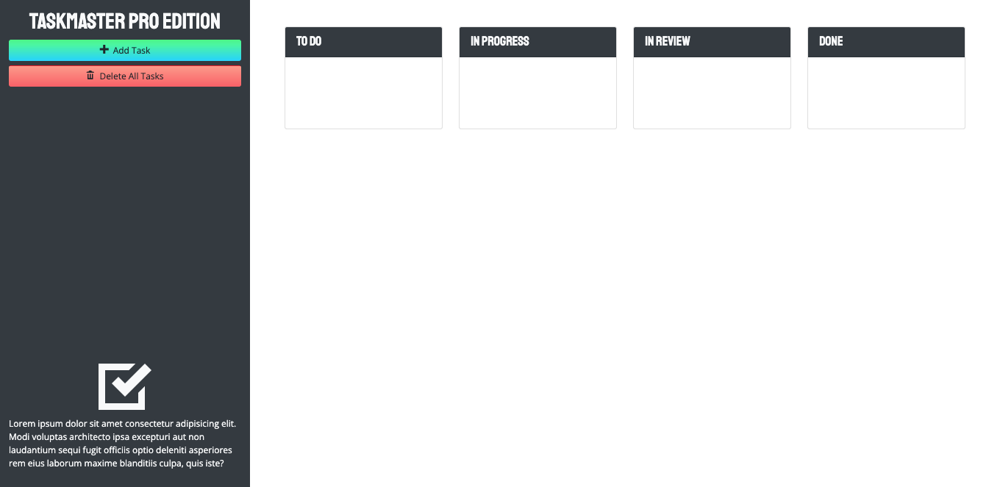

# taskmaster-pro

## Purpose
In this website a user us able to add tasks to a to do section,in progress section, a in review section and a done section initialy when a user adds a task it promts the user to add a task description and it also has a box for the user to pick a date. the date can only be in the future. the user can edit the date or the task description by simply clicking on the text or date itself

## Built With 
* HTML5
* CSS3
* Javascript

## Website Link
https://itzamary.github.io/taskmaster-pro/

## Image

